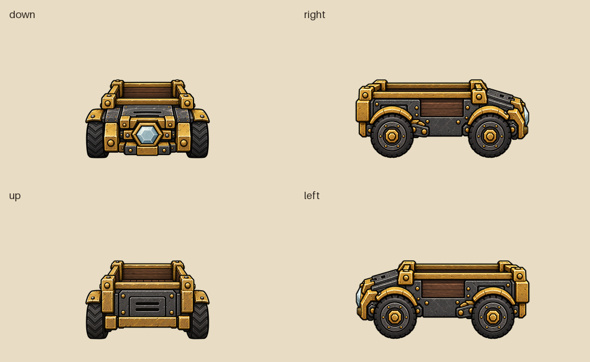
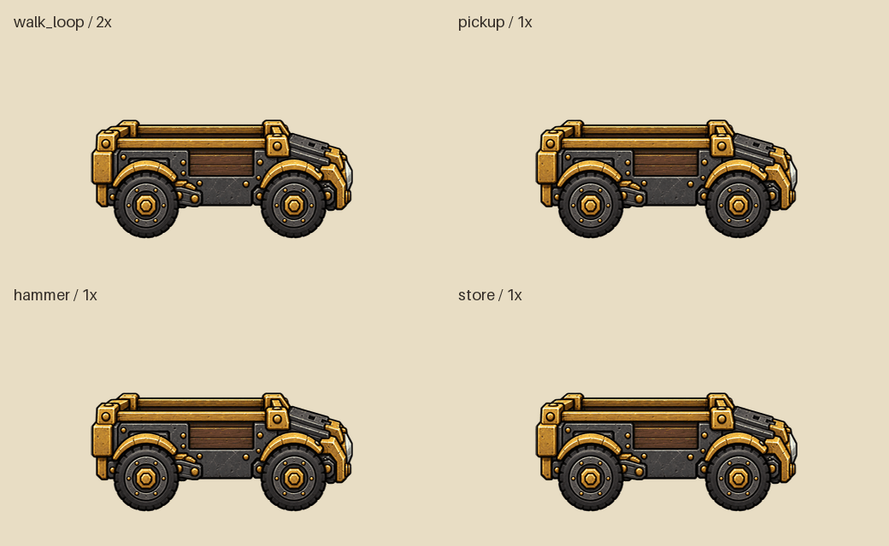

# 原创美术与动画

## V2 采集车与升级套件资源

V2 按已确认的 [设计方案](UPGRADE_PLAN.md) 制作。0.6.0 已接入等级、配方与右键安装，以下仍是可编译资源与离线预览，不是游戏截图或游戏录像。普通拾荒机贴图、动画 ZIP 和图标保持原样。





主预览上排为行走 / 拾取，下排为采摘或敲击 / 装箱。行走使用 2 倍节奏，对应计划移速 `3 → 6`；作业动作保持 1 倍，接触时刻仍为拾取 `.5` 秒、采摘 / 敲击 `.7` 秒、装箱 `.2` 秒。主预览在非循环动作间增加 `.4` 秒展示停顿；各动作独立 GIF 保留原完整帧数与精确总时长。GIF 按累计时间分配百分之一秒的帧间隔，避免逐帧取整导致额外加速。

动画继续使用单车身图层：闲置起伏、起步 / 行走 / 停步轻晃、拾取下沉、采摘 / 巨果后撤冲撞与回弹、装箱点头。车轮和轴座包含在车身源图内，没有独立轮子旋转。本轮没有模拟真实行走路径、箱子或植物交互。

源图由内置 imagegen 参照 V2 结构图分别生成，保留高分辨率 RGBA 原图：`assets/source/upgrade/body_front.png`、`body_side.png`、`body_back.png`、`kit_world.png`。三张车身图显示同一金属底盘、木衬货斗与金框；前部为六角月岩机芯，后部为双槽检修盖。侧面明确朝右，前后轮均完整，左面由引擎镜像，不生成预镜像贴图。生成提示词：[前视](art/body_front_production_prompt.txt)、[侧视](art/body_side_production_prompt.txt)、[后视](art/body_back_production_prompt.txt)、[套件](art/kit_production_prompt.txt)。

`assets/source/upgrade/rig.json` 定义三视图、140 单位车身高度、底部中心枢轴和 30 FPS。前后视宽度统一为 220，侧视保持批准的较长轮廓，缩放后宽 307；绑定规格校正独立生成时的轻微前后宽度差。构建以 alpha ≥ 4 的可见范围确定裁边，忽略生成源中远离轮廓的近透明噪点；保留裁边区域内的原始 RGBA 与抗锯齿边缘，再按规格缩放。套件由 `kit_rig.json` 定义 56 单位高度，使用独立的全朝向 `idle` 动画，库存图标直接从同一源图生成，避免世界 / 背包出现两种造型。

| 输出 | 内容 |
| --- | --- |
| `anim/automatic_collector_mk2.zip` | 独立同名 bank / build，三视图共 21 段、585 帧，BILD / ANIM / BC3 图集齐全 |
| `anim/ac_upgrade_kit.zip` | 独立 bank / build，一个静态 `idle`，facing `255` |
| `images/inventoryimages/automatic_collector_mk2.*`、`ac_upgrade_kit.*` | 64×64 背包图标，内容最长边 ≤48，留白至少 8 |
| `images/map_icons/automatic_collector_mk2.*` | 独立地图图标 |
| `assets/generated/upgrade/collector/` | 缩放零件、图集、SCML、四方向图、精确接触帧表、单动作 GIF 与总览 |
| `assets/generated/upgrade/kit/` | 世界源图缩放输出、图集、SCML、地面与图标预览 |

升级车比原车更长，使用新 bank 计算与贴图一致的每帧动画边界；复用 `tools/build_assets.py` 的动作曲线，动作名称和接触帧与普通车一致。等级网络字段同步切换 bank / build；不加载一份同名旧 bank 覆盖原车动画边界。

在仓库根目录重建升级美术：

```powershell
$env:UV_CACHE_DIR = Join-Path (Get-Location) '.cache/uv'
uv run --locked -m tools.build_upgrade_assets --mod-tools "D:/Programs/Steam/steamapps/common/Don't Starve Mod Tools/mod_tools"
```

默认工具路径相同时可省略 `--mod-tools`。此命令只生成升级资产，不重建原车或模组图标。修改应落在源图、绑定规格或共享运动曲线，不能手工修改输出 SCML。构建会检查预览中所有姿势的裁切范围；资源测试还独立解码动画边界、顶点、bank / build 与时序。

已注册套件配方、右键安装、升级同步及名字字符串。玩法规格为「采集车」、移速 6、作业时间不变，配方铥矿 ×10 / 废铁 ×3 / 月岩 ×5。玩家操作见 0.6.0 README；正式客户端尺寸、镜头朝向、透明边缘与动作接触效果仍需用户实机验收。

## 普通拾荒机资源与历史调整

v0.4.0 模型仅包含车身及贴图自带的车轮，使用 `assets/source/body_front.png`、`body_side.png`、`body_back.png` 三张透明图。侧面只有原图中的两只轮子；夹子、盖子、独立轮子和货包全部移除，库存中的货物不再另绘图层。

三张车身图直接沿用此前由内置 `image_gen` 生成的原创车身，本轮通过原生绑定和动画代码简化模型，没有重新绘制。原生成提示词保留于 [ART_PROMPT_CART.txt](ART_PROMPT_CART.txt)，其中已经删除的零件不参与当前构建。旧整张零件图及人形角色图已清理。不复制或分发原版及工坊美术。

`assets/source/rig.json` 定义三张图的源文件、140 单位高度、底部中心枢轴、30 FPS 和动作长度；`tools/build_assets.py` 编排单个车身的位移、旋转和缩放，编译 BILD v6 / ANIM v4，再由官方 TextureConverter 编译预乘 alpha 的 BC3 纹理。游戏显示倍率保持 `1.15`，阴影保持 `2.4 × 1.3`。

| 动作 | 长度 | 交互时刻 | 说明 |
| --- | --- | --- | --- |
| idle | 2 秒循环 | 无 | 轻微机械起伏 |
| walk_pre / walk_pst | .2 秒 | 无 | 起步、停步小幅晃动 |
| walk_loop | .8 秒循环 | 无 | 车身轻晃，不叠加独立车轮 |
| pickup | 1 秒 | .5 秒 | 实体到达掉落物中心附近后，车身下沉并轻微压缩，再复位 |
| PICK / HARVEST | 1.3 秒 | .7 秒 | 复用 hammer 冲撞，保留原版采摘/收获动作 |
| hammer | 1.3 秒 | .7 秒 | 原先确认的后撤蓄力、前冲、回弹曲线保持不变 |
| store | 1 秒 | .2 秒（第 6 帧） | 轻微点头下沉、复位，不显示额外零件；箱子保持开启到动画结束 |

v0.4.2 将 `rig.json` 的装箱接触帧及点头曲线一并提前到第 6 帧，重新生成编译动画、SCML 和预览，使车身到达接触姿势时才执行存放。冲撞和拾取曲线保持不变。

v0.4.3 将背包图标由 128×128 调整为 64×64，车身内容最长边不超过 48 像素，四周至少留白 8 像素。独立预览为 `assets/generated/inventory_automatic_collector.png`，避免被同名小地图预览覆盖。小地图和模组图标规格保持不变，不影响游戏实体大小。

拾取只为本模组的 BufferedAction 设置 `1` 世界单位的到达距离，不修改原版全局 PICKUP。下沉和冲撞本身只移动动画图层，不瞬移实体；实际移动由原版 locomotor 完成。

七种动作分别导出前、共享侧面和后三种视图，共 21 段、585 帧，每帧仅一个车身元素。facing 掩码为前 `8`、侧面 `5`、后 `2`，配合 `SetFourFaced`；左侧由引擎镜像，不重复导出左侧。四方向预览中的左侧仅用于离线查看。

`assets/generated/automatic_collector.scml`、图集、GIF 和图标均由构建生成，重新构建会覆盖。修改请在源图、`rig.json` 和运动曲线中进行；构建器不反读 SCML。构建时自动删除 `assets/generated/parts/` 中不再被绑定使用的 PNG，避免旧胳膊、夹子等残留。旧 `pick` 动画及 GIF 已删除，采集统一使用 hammer。

动画速度倍率同时调整播放和状态机交互时刻。离线 GIF 不是游戏录屏，客户端尺寸、镜头朝向和拾取路径仍需用户验收。
