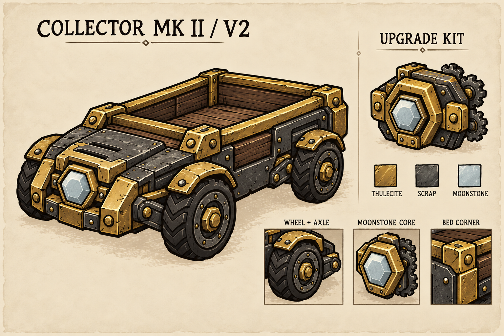
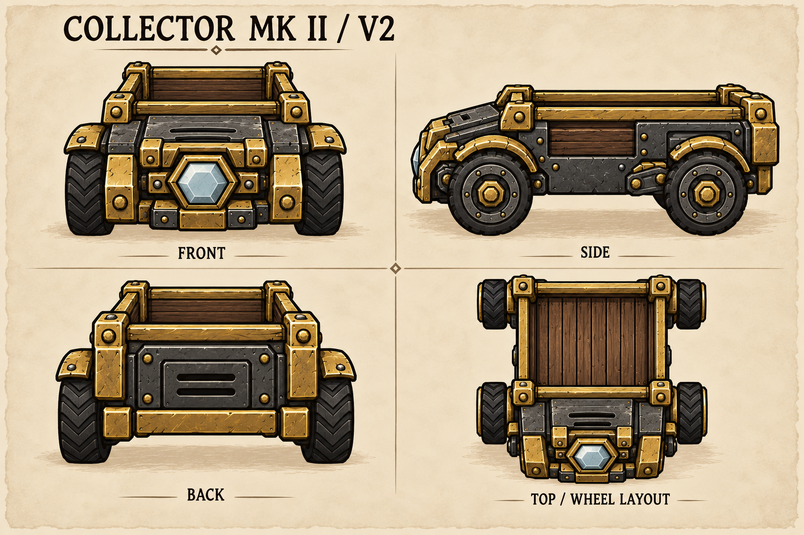

# 拾荒机升级套件：美术方案与实施计划

状态：0.6.0 已实现美术接入、套件配方、右键安装、等级持久化、外观同步及移速 6，完成离线回归；客户端尺寸与联网效果待用户实机验收。日期：2026-10-03。

## 玩法方案

玩家制作「拾荒机升级套件」，拿在鼠标上右键地面上的普通拾荒机，消耗一个套件，将原小车永久升级为「铥矿采集车」。升级改变外观与移动速度，作业动作时间保持不变；首版只有一个升级等级。

| 项目 | 建议方案 | 设计理由 |
| --- | --- | --- |
| 套件名称 | 拾荒机升级套件 | 配方、背包与右键动作使用同一名称 |
| 升级版名称 | 铥矿采集车 | 与金色加固框架对应，区别于普通拾荒机 |
| 配方 | 铥矿 × 10、废铁 × 3、月岩 × 5 | 使用用户指定数量，三种材料均实际消耗 |
| 材料 prefab | `thulecite`、`wagpunk_bits`、`moonrocknugget` | 实现时核对目标游戏版本的废铁配方与可获取性 |
| 解锁 | 炼金引擎，科学 / 建筑筛选 | 与原车一致；材料获取本身承担后期门槛 |
| 套件形态 | 可携带、可堆叠、一次性使用 | 堆叠上限 20，方便多台机器升级 |
| 升级次数 | 每辆小车一次，不可重复消耗 | 已升级目标显示失败原因并保留套件 |
| 移速 | `3 → 6`，倍率 `2` | 相同路线的纯行走耗时约减半 |
| 作业动作 | 保持倍率 `1` | 拾取、采摘、收获、敲巨果、装箱的时间均保持原值 |

材料数量、移速和动作时间已按用户最新要求确定。实际吞吐受路线、路径拥挤、目标扫描、作业动作、箱子容量及批次流程影响，不能直接等同于整体效率翻倍。

首版维持一个运输槽、既有工作半径、5 个作物一批、巨大作物先敲开、样品箱规则和无燃料设定。月岩核心用于外观辨识，不提供照明。新旧小车可同时使用并共享接收箱。

## 美术方向 V2：金属底盘、四轮悬挂、嵌入式月岩机芯

V2 根据「后轮丢失、升级幅度不足、细节不统一」的反馈重新设计。V1 主透视图没有清楚交代近侧后轮，主体仍是原木车外壳，不能作为正式资源制作依据；[旧概念图](art/upgrade_concept_v1.png) 仅保留用于修订对照。

以上为内置 imagegen 生成的原创设计预览，不是游戏截图或可直接编译的透明贴图。当前提示词分别为 [主概念图](art/upgrade_concept_v2_prompt.txt) 和 [结构视图](art/upgrade_structure_v2_prompt.txt)。主图用于整体造型和细节，结构图用于核对前后轮、轴距、货斗和机芯的位置；制作源图时按下列结构约束统一，不能直接裁切概念图替代贴图。

### 升级小车

保留低矮四轮搬运小车、开放货斗和粗黑手绘轮廓，主体改为短鼻、折面金属底盘与一体式后货斗。区别于原木桶车的大块木板外壳，木材主要作为货斗内衬与少量侧面嵌板；铥矿承担框架，废铁承担底盘与轮组，月岩承担前部机芯视觉。整体更精密，但仍是饥荒风格的小型工具车。

- **底盘**：暗铁灰折面外壳，前部短而倾斜，下方设紧凑护梁；货斗位于后部，底盘与货斗边缘有明确接缝。不能用新的颜色继续描摹原木桶外壳。
- **铥矿框架**：哑光旧金色纵向导轨、货斗包角、前护梁及机芯固定座，包角有斜切边和少量固定螺栓；边框必须首尾连接，不悬空或无故穿过车轮。
- **四轮轮组**：前后两轴，每轴左右各一轮，四轮物理直径一致。两只近侧轮在主透视图中必须分离可辨；侧视图前后轮均完整，不能以装甲或轮毂装饰替代后轮。远侧轮允许正常透视遮挡，但俯视结构必须能核对四个轮位。
- **轮胎与轮毂**：深色轮胎采用简化人字胎纹，暗铁轮面配旧金六角轮毂与轴承圆环；轮胎、轮面和轮毂有清楚的同心层次，轮毂不得偏离圆心。接地高度和轮胎厚度一致。
- **挡泥板与悬挂**：每侧前后各一段独立短挡泥板，中间有间隔，只遮住轮胎顶部约五分之一；轮后可见连接到底盘的轴座或短支架。轮子不漂浮、轮轴不悬空，支架不横穿轮胎外表面。
- **月岩机芯**：只在车头中央设置一枚浅灰蓝六角切面晶芯，嵌入阶梯式六角铥矿座；固定座、晶石和底盘有内外层次，不画成眼睛。高光属于贴图，无灯光范围或粒子光晕。
- **货斗**：连续金属上沿、四个连接明确的包角、内侧木板衬底；空货斗开口可读，内外透视一致。不增加货包或储物盖。
- **车尾**：中央是嵌入式矩形检修盖和两条横向散热槽，对应前部机芯的维护结构；不再复制一枚车头晶芯。左右后轮与尾护梁须在后视图中有合理的连接和遮挡。
- **整体尺度**：车身高度维持 140 单位、底部中心枢轴。实际制作的前 / 后视均为 220×140，侧视为 307×140；相较原车 242×140 的侧面，新底盘长约 27%，采用已确认的 V2 较长货斗轮廓。实机验收时需核对碰撞范围及拾取 / 冲撞接触距离，不以离线预览代替实机尺寸验收。
- **表面细节**：磨损集中在包角和边缘，螺栓用于固定结构，木纹用于货斗内衬；保留大块安静色面，不均匀撒满划痕和铆钉。轮廓、机芯和轮组优先于微小纹理。

### 结构校对标准

前、侧、后视图必须来自同一结构；俯视只辅助核对轮位，不作为新增游戏 facing 导出。正式源图的高度、接地线和车身枢轴统一对齐。

| 检查项 | 主透视图 | 前 / 侧 / 后及俯视 |
| --- | --- | --- |
| 四轮与轴距 | 近侧前、后轮都有可读圆形轮廓，远侧轮遮挡合理 | 侧面两轮同径，俯视四轮分属两轴；前后视轴距透视对应 |
| 底盘与轮轴 | 每个可见轮组都有实际附着关系 | 轮轴位置、悬挂连接、挡泥板数量一致 |
| 月岩机芯 | 前部中央阶梯六角座，六角晶芯嵌入 | 前视有晶芯，侧视位于车头，后视为检修盖 |
| 货斗 | 开放后货斗，上沿连续，内衬可见 | 开口形状、四包角、底盘接缝一致 |
| 材料与细节 | 木材为内衬 / 嵌板，金属为主结构 | 金框、检修盖和胎纹不因视图切换而变成另一种结构 |
| 接地与透视 | 各轮落在同一地面，远侧大小符合透视 | 同尺度、同轮径、同接地基线，无倾斜底盘或漂浮轮 |

本轮目视检查：主图近侧前后两轮均可见；结构侧视图有两只分离、同径的轮子，俯视图有四个轮位、前后两轴；前视为六角月岩机芯，后视为双槽检修盖。概念图检查只确认设计可辨识；正式贴图仍须逐点校正轮径、连接位置和投影，不能将生成图的像素当作工程尺寸依据。

| 用途 | 主色建议 |
| --- | --- |
| 粗轮廓 | `#272321` |
| 货斗木衬 / 少量嵌板 | `#70513C` |
| 铥矿金框 | `#B69A4A` |
| 废铁底盘 / 轮面 | `#555953` |
| 月岩核心 | `#B8C8C7` |

### 升级套件

套件是一块装配完成的机芯模块：与车头一致的六角铥矿座包住月岩晶芯，暗铁背板带安装耳和紧凑齿板。轮廓以机芯为主，缩小两侧齿轮，避免像一辆只有车轮的小车。主图中的轮轴、机芯和货斗包角局部特写应对应同一辆车，不绘制另一套零件。

背包图标采用 64×64 透明画布，内容最长边不超过 48 像素，四周至少留白 8 像素；缩小后仍能分清金框、铁齿和月岩晶芯。地面形态表现同一模块平放或轻微倾斜，不能只使用背包贴图替代世界动画。

### 正式资源交付清单

下列贴图与编译资源已制作，prefab 注册、等级同步和套件安装已接入。美术构建与预览说明见 [ART.md](ART.md)。

| 内容 | 建议位置 | 要求 |
| --- | --- | --- |
| 升级车前 / 侧 / 后透明源图 | `assets/source/upgrade/body_front.png`、`body_side.png`、`body_back.png` | 按 V2 核对完整四轮、两轴、机芯 / 检修盖与货斗；侧面只导出一份 |
| 升级车绑定规格 | `assets/source/upgrade/rig.json` | 140 单位高度、底部中心枢轴、30 FPS，与原车对齐 |
| 套件源图 | `assets/source/upgrade/kit_world.png`、`kit_rig.json` | 同一源图生成地面形态与独立库存图标，保持一致 |
| 升级车编译动画与外观 | `anim/automatic_collector_mk2.zip` | 独立 bank / build，复用原车动作曲线与时序；按新车贴图计算动画边界 |
| 套件编译动画 | `anim/ac_upgrade_kit.zip` | 地面闲置形态与原版库存物理行为兼容 |
| 套件库存图标 | `images/inventoryimages/ac_upgrade_kit.xml/.tex` | 独立 atlas 与 image 注册 |
| 升级车库存与地图图标 | `images/inventoryimages/automatic_collector_mk2.xml/.tex`、`images/map_icons/automatic_collector_mk2.xml/.tex` | 捡起及重新放置后仍能识别等级 |
| 检查预览 | `assets/generated/upgrade/` | 四方向、动作接触帧、动作 GIF、64×64 图标 |

不手工修改生成的 SCML。四面实体继续用 `SetFourFaced`，前 / 侧 / 后 facing 掩码仍为 `8 / 5 / 2`，左侧由引擎镜像；机芯居中、左右结构对称，侧面须适合镜像。车轮和悬挂仍可绘在车身整图内以复用单图层曲线，本轮不承诺新增独立轮子旋转动画。

## 动作与升级表现

复用现有拾取下沉、采摘 / 敲巨果冲撞、装箱点头曲线，保持接触姿势和目标交互一致。升级版保留同名动作及原动作时长，不跳过接触动作。

| 动作 | 普通版总时长 / 接触 | 升级版总时长 / 接触 |
| --- | --- | --- |
| 拾取 `pickup` | 1.00 秒 / 0.50 秒 | 1.00 秒 / 0.50 秒 |
| 采摘、收获 `hammer` | 1.30 秒 / 0.70 秒 | 1.30 秒 / 0.70 秒 |
| 敲巨果 `hammer` | 1.30 秒 / 0.70 秒 | 1.30 秒 / 0.70 秒 |
| 装箱 `store` | 1.00 秒 / 0.20 秒 | 1.00 秒 / 0.20 秒 |

表中为理想状态机时间；实际交互发生在达到阈值后的首个模拟帧。所有动作仍仅交互一个目标一次，接触时重新验证。装箱在接触时执行原版 `STORE`，箱子保持小车自己的开启关系到状态退出；不得因加速提前漏关箱或关闭其他人的开启关系。

移动速度与工作动画倍率分开处理：闲置与作业动画保留原节奏；行走前摇、循环和收尾使用 2 倍视觉节奏，与移速 6 对应。现有通用 walk states 不直接套用 `WorkState` 的动作倍率，实施时检查状态进入 / 退出，确保退出行走后恢复倍率 1。GIF 与游戏状态机均按这一规则处理；行走退出钩子复位倍率。

升级成功使用一次短安装声和短促机械点头反馈，随后切换金框外观；点头复用现有动画，不增加长时间演出。声音优先使用可合法调用的原版声音事件，不打包游戏声音文件。此反馈不是额外作业，不接触采集目标。

## 操作与边界规则

| 场景 | 预期行为 |
| --- | --- |
| 鼠标拿着套件，右键未升级的地面小车 | 显示「升级拾荒机」，进入玩家短动作，服务端成功时消费一个套件 |
| 空手右键 | 沿用「暂停采集 / 启动采集」 |
| 套件右键已经升级的小车 | 提示「这辆拾荒机已经升级」，不消费，不回退成暂停动作 |
| 套件右键其他实体 | 不提供升级动作，不消费 |
| 正在行走或作业的小车 | 安装提交时安全取消当前未完成任务，释放占用并清理移动与箱子开启关系，再应用升级；保持原启停状态后重新规划 |
| 接触已发生的作业 | 已产生的真实物品和已成功的批次计数保留，不再次执行原动作 |
| 暂停中的小车 | 可升级，完成后继续暂停 |
| 背包或容器中的小车 | 不可升级，必须先放到地面 |
| 两名玩家同时安装 | 服务端逐次复查等级，只允许首次成功者消费一个套件 |
| 玩家中断、目标被捡起 / 移除、套件所有权变化 | 安装失败，保留材料，不遗留锁或忙碌状态 |
| 小车捡起、再放置、存档重载 | 等级、外观和倍率保持；工作中心与批次仍按现有拾取 / 放置规则处理 |

升级不更换实体 prefab，不生成一辆替代小车。安装当下保留货物原实体、数量、属性、工作中心、平台引用、启停状态和批次阶段；避免重建实体造成存档或目标占用丢失。

## 实施路径（第一至三阶段已完成）

### 第一阶段：正式贴图与构建支持

1. 按 V2 结构校对标准统一三视图，先锁定四轮 / 两轴和前后部件位置，再制作透明车身源图与套件源图。检查原版 / 升级版在相同尺度的轮廓辨识度、完整后轮及各轮接地关系，不把主图直接缩小当游戏贴图。
2. 已扩展 `tools/build_assets.py` 的源图、输出目录和 bank 规格，由 `tools/build_upgrade_assets.py` 独立构建新车与套件，原车默认构建入口不变。
3. 原车保留 `automatic_collector` bank / build；升级车使用独立 `automatic_collector_mk2` bank / build、相同 `body_front` / `body_side` / `body_back` symbols，复用同一套动作曲线。V2 车身尺寸与原车不同，单独生成 ANIM 的每帧边界，避免套用原车较小的裁切 / 剔除范围。
4. 接入套件世界动画、库存图标及升级车库存 / 地图图标。用官方 TextureConverter 编译纹理，检查透明边缘、地图识别和 64×64 库存留白。

### 第二阶段：等级、外观与速度

1. 新增内置升级定义模块（建议 `scripts/ac_upgrades.lua`），以 `ac_chassis_mk2` 为注册名，`maxlevel = 1`，通过现有 `ac_api.RegisterUpgrade` / `ac_upgradable` 持久化。
2. `apply` 幂等设置 `SetMoveSpeed(2)`，即移速 6，作业动作倍率维持 1；等级 0 恢复移速倍率 1，禁止每次加载都累乘速度。仅行走状态使用 2 倍动画播放，退出后恢复原值。注册在实体加载前完成。
3. 继续使用原小车 prefab；在 `SetPristine` 前声明带 dirty 事件的等级网络字段。服务端变更后同步等级，客户端根据等级切换 bank、build 和地图外观，不读取服务端组件。升级动画 bank 保留原动作名称，无需另写一套作业 StateGraph。
4. 外观刷新同时覆盖初始生成、dirty 事件、读档和晚加入客户端；服务器维护库存图标状态，并验证其在客户端的显示。名字显示依据等级单独处理，不依赖全局重命名原 prefab。
5. `ac_upgradable:OnLoad` 的延迟应用需测试加载顺序：先恢复有效基础组件，再应用等级；旧存档没有等级时仍为普通版。保留未知扩展等级。
6. 现有速度接口是绝对倍率；其他扩展若同时设置速度会覆盖。首版明确此边界并检查本内置升级的重复应用，不宣称与所有速度扩展自动叠加。

### 第三阶段：套件与右键安装

1. 新增 `scripts/prefabs/ac_upgrade_kit.lua` 和服务端安装组件（建议 `scripts/components/ac_upgradeitem.lua`）；在 `modmain.lua` 注册 prefab、配方、字符串与资产。
2. 增加独立 `AC_UPGRADE` 动作，通过套件的 `USEITEM` component action 接入右键，匹配客户端可见的物品 / 目标标签与等级；客户端仅决定提示与预测，服务端权威执行。
3. 动作优先级高于现有 `AC_TOGGLE` 的 2；手持套件指向小车时抑制暂停候选，已升级时也不得误触发暂停。为 `wilson` / `wilson_client` 注册一致的短动作 handler；骑乘场景需核对原版可用状态。
4. 安装提交函数首先复查 doer、套件所有权与数量、目标有效性、落地状态及等级；全部条件通过后才清理小车旧任务并应用升级。
5. 不直接把 `SetLevel` 的返回值当作「首次升级成功」：该接口对重复同等级调用也可返回 true，必须先检查原等级。消费堆叠中的恰好一个套件，余量保持原实例属性；失败不得误删整组。
6. 同一服务端提交内完成等级应用与单件消费，不通过延迟任务跨帧提交。设计失败回退，确保消费失败或应用异常不会出现免费升级 / 丢材料；升级处理中拒绝重入，成功或失败均清理临时状态。
7. 使用现有取消 / 失败清理路径释放任务，不裸写 `pending = nil`；内部安装取消不为目标新增失败冷却。原启停、货物与批次状态保留，升级后再恢复规划。

### 第四阶段：说明、回归与发行

已更新 README 的制作 / 操作、升级说明与速度信息，并同步 `docs/ART.md`、`API.md`、`TECHNICAL_REPORT.md`、`TESTING.md` 和 `DEVELOPMENT.md`。

功能版本为 0.6.0，已同步 `modinfo.lua`、`pyproject.toml`、锁文件和 README。`modinfo.lua` 的 description 仅更新版本号，不改文案内容。通过检查后由 `tools/publish.py` 生成白名单发行目录，概念图与开发文档不加入发行资源。

## 验证与验收清单

已新增 LuaJIT 安装、竞态、异常回退、动作清理、读档及客户端初始化场景；具体结果见 [验证记录](TESTING.md)。下列网络与物理项目仍需实机验收。

- **消费与竞态**：单个 / 堆叠套件、两玩家同时升级、重复回调、已升级目标、错误目标、动作中断、目标拾起 / 移除、所有权变化、异常回退；成功一次只少一个套件。
- **工作状态**：行走、接触前、接触后、装箱开启期间、暂停、持货和船上安装；保留货物守恒、工作中心、批次进度，无重复产物、残留占用或箱子开启关系。
- **速度与动画**：倍率幂等、升级读档不累乘；表中接触前不执行、接触后只执行一次；升级 / 普通车共存；验证行走与闲置倍率复位，升级版完整装箱清理。
- **存档兼容**：旧存档、升级后捡起 / 放置、休眠与恢复、重载、未知扩展升级等级保留；等级与实际速度一致。
- **多人显示**：主机和远端客户端、晚加入、洞穴 / 跨分片、地面 / 背包 / 地图图标；级别、右键提示与外观一致。网络实际行为由用户实机验收。
- **资源与发行**：原车编译资源仍有效，新 build symbols 对齐，套件有地面形态，三视图尺寸与透明边缘正确；发行包含新动画 / 图标，排除源图、参考和概念图。

实施后执行 `uv run pytest -q`、`uv run ruff check tools tests`、`uv run ruff format --check tools tests`、`uv run ty check tools tests`，资源改动还需构建与发行检查。移速提高后，拥挤路径、多人状态同步和第三方采摘回调仍需实机测试；不自动启动游戏客户端或专用服务器。

## 本轮交付与下一步

已完成 V2 美术、独立动画与图标、套件 prefab / 配方、右键安装、单级等级存档、外观及名字同步、移速 6 和作业时间不变。安装保留原实体、货物及批次，支持单件 / 堆叠消费、重复安装拒绝和异常回退。README、技术及接口文档同步为 0.6.0，发行仅通过白名单脚本生成。

剩余验收由用户在游戏中完成：尺寸与朝向、较长车身的碰撞及交互距离、主机 / 远端 / 晚加入、骑乘、船与洞穴、库存及地图图标。离线回归不证明真实联网和物理已通过；本轮不启动游戏客户端或专用服务器。
